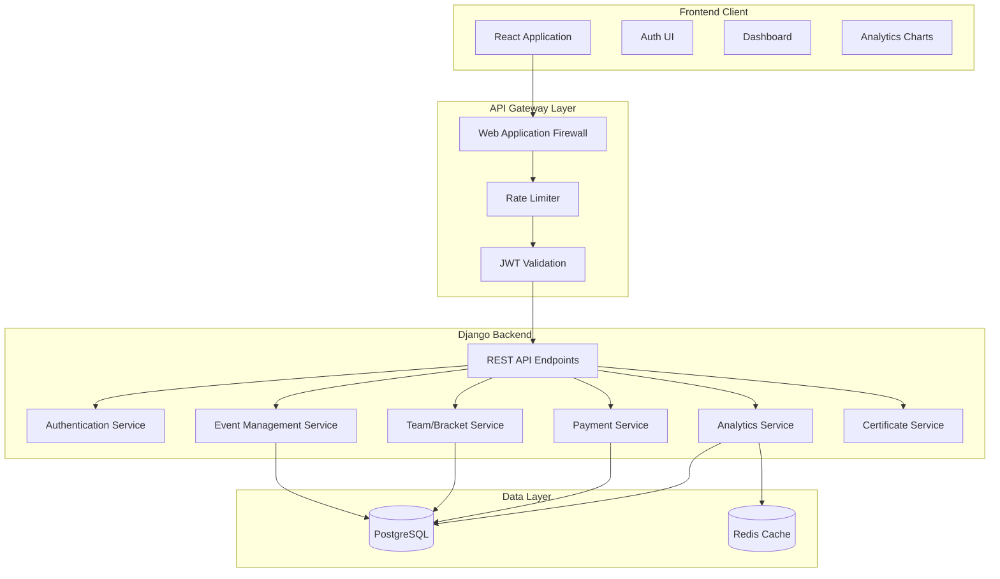
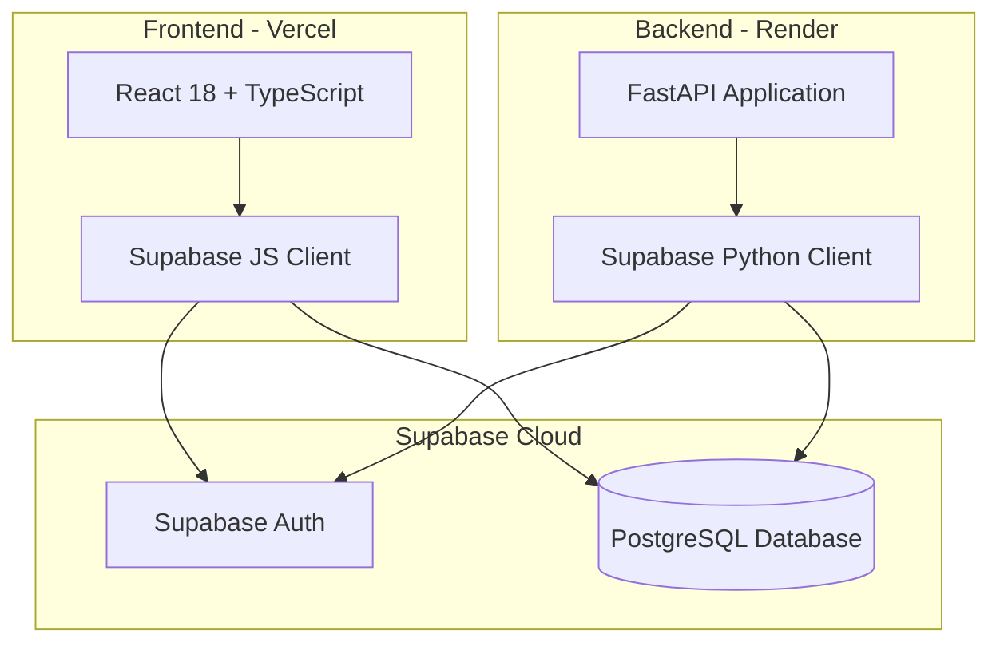

# BCE Event Manager - Project Specification

## 1. Project Overview

**Project Name:** BCE Event Manager  
**Project Type:** Full-stack Web Application  
**Core Functionality:** A comprehensive event management platform for organizing sports tournaments, tech fests, seminars, and all types of events with real-time analytics, financial tracking, and role-based access control.  
**Target Users:** Event Organizers, Team Captains/Speakers, Volunteers, and General Attendees

---

## 2. Technology Stack

### Backend
- **Framework:** FastAPI (Python 3.11+)
- **API:** FastAPI with Pydantic models
- **Authentication:** Supabase Auth (JWT tokens managed by Supabase)
- **Database:** Supabase PostgreSQL
- **DB Client:** supabase Python client
- **Validation:** Pydantic
- **CORS:** FastAPI CORS middleware

### Frontend
- **Framework:** React 18 with TypeScript
- **Build Tool:** Vite
- **State Management:** React Query (TanStack Query) + Zustand
- **Routing:** React Router v6
- **HTTP Client:** Supabase JS client
- **UI Components:** Material UI (MUI) v5
- **Charts:** Recharts
- **Forms:** React Hook Form + Zod validation

### Security
- **SQL Injection:** Parameterized queries via Supabase client
- **XSS Prevention:** DOMPurify + React's auto-escaping
- **CSRF Protection:** N/A (Supabase handles auth state)
- **Rate Limiting:** FastAPI slowapi
- **Input Validation:** Pydantic (backend) + Zod (frontend)
- **Auth Security:** Supabase-managed JWT with short expiration

---

## 3. System Architecture



---

## 4. Database Schema

### Core Models

#### User Model
```python
class User(AbstractBaseUser):
    id = UUIDField(primary_key=True)
    email = EmailField(unique=True)
    username = CharField(max_length=150, unique=True)
    password = CharField(max_length=255)  # Hashed
    role = EnumField(UserRole, default=UserRole.ATTENDEE)
    first_name = CharField(max_length=100)
    last_name = CharField(max_length=100)
    phone = CharField(max_length=20)
    is_active = BooleanField(default=True)
    is_verified = BooleanField(default=False)
    created_at = DateTimeField(auto_now_add=True)
    updated_at = DateTimeField(auto_now_add=True)
```

#### Event Model
```python
class Event(models.Model):
    id = UUIDField(primary_key=True)
    name = CharField(max_length=255)
    description = TextField()
    event_type = EnumField(EventType)  # SPORTS, TECH_FEST, SEMINAR, OTHER
    organizer = ForeignKey(User, on_delete=CASCADE)
    start_date = DateTimeField()
    end_date = DateTimeField()
    venue = CharField(max_length=255)
    max_participants = IntegerField()
    registration_deadline = DateTimeField()
    status = EnumField(EventStatus)  # DRAFT, PUBLISHED, ONGOING, COMPLETED, CANCELLED
    cover_image = ImageField()
    created_at = DateTimeField(auto_now_add=True)
```

#### Team Model
```python
class Team(models.Model):
    id = UUIDField(primary_key=True)
    name = CharField(max_length=255)
    event = ForeignKey(Event, on_delete=CASCADE)
    captain = ForeignKey(User, on_delete=SET_NULL, null=True)
    status = EnumField(TeamStatus)  # REGISTERED, CONFIRMED, ELIMINATED, WINNER
    created_at = DateTimeField(auto_now_add=True)
```

#### Team Member Model
```python
class TeamMember(models.Model):
    id = UUIDField(primary_key=True)
    team = ForeignKey(Team, on_delete=CASCADE)
    user = ForeignKey(User, on_delete=CASCADE)
    role = CharField(max_length=50)  # PLAYER, SUBSTITUTE, COACH
    jersey_number = IntegerField(null=True)
    is_active = BooleanField(default=True)
```

#### Match Model
```python
class Match(models.Model):
    id = UUIDField(primary_key=True)
    event = ForeignKey(Event, on_delete=CASCADE)
    team1 = ForeignKey(Team, related_name='home_matches', on_delete=CASCADE)
    team2 = ForeignKey(Team, related_name='away_matches', on_delete=CASCADE)
    score_team1 = IntegerField(default=0)
    score_team2 = IntegerField(default=0)
    match_date = DateTimeField()
    venue = CharField(max_length=255)
    status = EnumField(MatchStatus)  # SCHEDULED, IN_PROGRESS, COMPLETED, CANCELLED
    winner = ForeignKey(Team, null=True, on_delete=SET_NULL)
```

#### Registration Model
```python
class Registration(models.Model):
    id = UUIDField(primary_key=True)
    user = ForeignKey(User, on_delete=CASCADE)
    event = ForeignKey(Event, on_delete=CASCADE)
    team = ForeignKey(Team, null=True, on_delete=SET_NULL)
    status = EnumField(RegistrationStatus)  # PENDING, CONFIRMED, CANCELLED
    payment_status = EnumField(PaymentStatus)  # UNPAID, PAID, REFUNDED
    payment_amount = DecimalField(max_digits=10, decimal_places=2)
    payment_method = CharField(max_length=50, null=True)
    transaction_id = CharField(max_length=100, null=True)
    registered_at = DateTimeField(auto_now_add=True)
```

#### Expense Model
```python
class Expense(models.Model):
    id = UUIDField(primary_key=True)
    event = ForeignKey(Event, on_delete=CASCADE)
    category = CharField(max_length=100)  # VENUE, EQUIPMENT, PRIZES, FOOD, etc.
    description = CharField(max_length=255)
    amount = DecimalField(max_digits=10, decimal_places=2)
    date = DateField()
    receipt = FileField(null=True)
    created_by = ForeignKey(User, on_delete=SET_NULL, null=True)
```

#### Sponsor Model
```python
class Sponsor(models.Model):
    id = UUIDField(primary_key=True)
    event = ForeignKey(Event, on_delete=CASCADE)
    name = CharField(max_length=255)
    logo = ImageField()
    website_url = URLField(null=True)
    tier = EnumField(SponsorTier)  # PLATINUM, GOLD, SILVER, BRONZE
    display_order = IntegerField(default=0)
```

#### Volunteer Model
```python
class Volunteer(models.Model):
    id = UUIDField(primary_key=True)
    user = ForeignKey(User, on_delete=CASCADE)
    event = ForeignKey(Event, on_delete=CASCADE)
    assigned_shift = ForeignKey(Shift, on_delete=SET_NULL, null=True)
    role = CharField(max_length=100)
    status = EnumField(VolunteerStatus)  # ASSIGNED, ON_DUTY, COMPLETED
```

#### Shift Model
```python
class Shift(models.Model):
    id = UUIDField(primary_key=True)
    event = ForeignKey(Event, on_delete=CASCADE)
    name = CharField(max_length=255)
    start_time = DateTimeField()
    end_time = DateTimeField()
    location = CharField(max_length=255)
    required_volunteers = IntegerField()
```

#### Announcement Model
```python
class Announcement(models.Model):
    id = UUIDField(primary_key=True)
    event = ForeignKey(Event, on_delete=CASCADE)
    title = CharField(max_length=255)
    message = TextField()
    priority = EnumField(Priority)  # LOW, MEDIUM, HIGH, URGENT
    created_by = ForeignKey(User, on_delete=SET_NULL, null=True)
    created_at = DateTimeField(auto_now_add=True)
```

---

## 5. API Endpoints

### Authentication
- `POST /api/auth/register/` - User registration
- `POST /api/auth/login/` - User login (returns JWT)
- `POST /api/auth/refresh/` - Refresh JWT token
- `POST /api/auth/logout/` - Invalidate tokens
- `POST /api/auth/password-reset/` - Request password reset
- `POST /api/auth/password-reset-confirm/` - Confirm password reset

### Users
- `GET /api/users/me/` - Get current user profile
- `PUT /api/users/me/` - Update current user profile
- `GET /api/users/{id}/` - Get user by ID (admin only)

### Events
- `GET /api/events/` - List all events (with filters)
- `POST /api/events/` - Create new event (organizer only)
- `GET /api/events/{id}/` - Get event details
- `PUT /api/events/{id}/` - Update event (organizer only)
- `DELETE /api/events/{id}/` - Delete event (organizer only)
- `GET /api/events/{id}/analytics/` - Get event analytics

### Teams
- `GET /api/events/{id}/teams/` - List teams for event
- `POST /api/events/{id}/teams/` - Create team
- `GET /api/teams/{id}/` - Get team details
- `PUT /api/teams/{id}/` - Update team
- `POST /api/teams/{id}/members/` - Add member to team
- `DELETE /api/teams/{id}/members/{user_id}/` - Remove member

### Matches/Brackets
- `GET /api/events/{id}/matches/` - List all matches
- `POST /api/events/{id}/matches/` - Create match (organizer)
- `PUT /api/matches/{id}/` - Update match score
- `POST /api/events/{id}/brackets/generate/` - Auto-generate brackets
- `GET /api/events/{id}/brackets/` - Get tournament bracket visualization

### Registrations
- `POST /api/events/{id}/register/` - Register for event
- `GET /api/registrations/my/` - Get my registrations
- `GET /api/events/{id}/registrations/` - List registrations (organizer)
- `PUT /api/registrations/{id}/status/` - Update registration status

### Payments
- `POST /api/payments/initiate/` - Initiate payment
- `POST /api/payments/verify/` - Verify payment
- `GET /api/events/{id}/financials/` - Get financial summary

### Volunteers
- `GET /api/events/{id}/shifts/` - List available shifts
- `POST /api/events/{id}/shifts/{id}/assign/` - Assign self to shift
- `GET /api/events/{id}/volunteers/` - List volunteers (organizer)

### Analytics
- `GET /api/analytics/overview/` - Global analytics
- `GET /api/analytics/events/{id}/` - Event-specific analytics
- `GET /api/analytics/registrations/timeline/` - Registration timeline
- `GET /api/analytics/demographics/` - Attendee demographics
- `GET /api/analytics/financial/` - Financial reports
- `GET /api/analytics/export/` - Export analytics as CSV/PDF

### Announcements
- `GET /api/events/{id}/announcements/` - List announcements
- `POST /api/events/{id}/announcements/` - Create announcement
- `DELETE /api/announcements/{id}/` - Delete announcement

### Certificates
- `POST /api/certificates/generate/` - Generate certificate
- `GET /api/certificates/{id}/` - Download certificate
- `POST /api/certificates/bulk/` - Bulk generate certificates

---

## 6. Security Implementation

### Authentication & Authorization
- Supabase Auth with JWT tokens
- Role-based access control (RBAC) on all endpoints
- CORS configured for specific domains only

### Input Validation
- All inputs validated using Django serializers
- Zod schemas on frontend
- File upload restrictions (type, size)
- SQL injection prevention via Django ORM

### XSS Prevention
- React auto-escapes rendered content
- DOMPurify for any HTML content
- Content Security Policy (CSP) headers

### CSRF Protection
- Django CSRF tokens on all forms
- SameSite cookie configuration
- Custom header requirement for API calls

### Rate Limiting
- Login: 5 attempts per minute
- Registration: 3 attempts per IP per hour
- API: 100 requests per minute (authenticated)
- Public endpoints: 20 requests per minute

### Data Protection
- HTTPS enforced in production
- Sensitive data encryption at rest
- PII data masking in logs
- Audit logging for all admin actions

---

## 7. Feature Modules

### Module 1: User Management
- [x] Multi-role system (Admin, Organizer, Captain, Attendee)
- [x] Secure registration and login
- [x] Profile management
- [x] Password reset flow
- [x] Email verification (optional)

### Module 2: Event Management
- [x] Create/Edit/Delete events
- [x] Event types (Sports, Tech Fest, Seminar, Other)
- [x] Event status workflow (Draft → Published → Ongoing → Completed)
- [x] Custom registration forms
- [x] Cover image upload
- [x] Venue and schedule management

### Module 3: Team & Bracket System
- [x] Team creation and management
- [x] Team member management
- [x] Auto-generate knockout brackets
- [x] Auto-generate round-robin brackets
- [x] Match scheduling
- [x] Live score updates
- [x] Winner declaration

### Module 4: Registration & Payments
- [x] Event registration
- [x] Individual and team registration
- [x] Payment integration (Razorpay/Stripe placeholder)
- [x] Registration status tracking
- [x] QR code ticket generation
- [x] Check-in system

### Module 5: Financial Management
- [x] Budget tracking
- [x] Expense logging
- [x] Revenue tracking
- [x] Sponsor management
- [x] Financial reports
- [x] Profit/Loss calculation

### Module 6: Volunteer Management
- [x] Shift creation
- [x] Volunteer assignment
- [x] Shift tracking
- [x] Volunteer status updates

### Module 7: Communications
- [x] Event announcements
- [x] Priority-based messaging
- [x] Internal organizer chat (SOS)
- [x] Push notifications (future)

### Module 8: Analytics Dashboard
- [x] Registration timeline chart
- [x] Participant demographics pie chart
- [x] Event capacity gauge
- [x] Financial bar charts
- [x] Team/Participant breakdown
- [x] No-show analytics
- [x] Export to CSV/PDF

### Module 9: Certificates
- [x] Certificate template management
- [x] Auto-generate participation certificates
- [x] Auto-generate winner certificates
- [x] Bulk certificate generation
- [x] PDF download

---

## 8. Frontend Pages & Components

### Public Pages
- Landing Page
- Event Listing Page
- Event Detail Page
- User Login/Register
- Public Analytics (if enabled)

### Attendee Dashboard
- My Registrations
- My Teams
- My Certificates
- Profile Settings

### Organizer Dashboard
- Event Management (CRUD)
- Team Management
- Match Management
- Registration Management
- Financial Overview
- Volunteer Management
- Analytics Dashboard
- Announcements
- Certificate Generation

### Admin Dashboard
- All Users Management
- All Events Overview
- System Analytics
- Settings

---

## 9. Development Phases

### Phase 1: Foundation (Week 1-2)
- Project setup (FastAPI + React + Supabase)
- Supabase project configuration
- Database tables and RLS policies
- Authentication system (Supabase Auth)
- Basic user profiles

### Phase 2: Core Features (Week 3-4)
- Event CRUD operations
- Team management
- Registration system
- Basic dashboard

### Phase 3: Advanced Features (Week 5-6)
- Tournament bracket generation
- Match management
- Payment integration
- Announcements

### Phase 4: Analytics & Reports (Week 7)
- Analytics dashboard
- Charts and visualizations
- Data export functionality

### Phase 5: Polish & Security (Week 8)
- Security audit
- Rate limiting
- Certificate generation
- Testing and bug fixes
- Deployment preparation

---

## 10. Deployment Architecture



### Deployment Steps

1. **Supabase Setup:**
   - Create a new Supabase project
   - Set up database tables using Supabase SQL Editor
   - Configure Row Level Security (RLS) policies
   - Set up authentication providers

2. **Backend Deployment (Render):**
   - Connect GitHub repository to Render
   - Set environment variables (SUPABASE_URL, SUPABASE_ANON_KEY)
   - Deploy FastAPI application

3. **Frontend Deployment (Vercel):**
   - Connect GitHub repository to Vercel
   - Set environment variables (VITE_SUPABASE_URL, VITE_SUPABASE_ANON_KEY)
   - Deploy React application

---

## 11. Project Structure

```
bce_event_manager/
├── backend/
│   ├── main.py                 # FastAPI application entry point
│   ├── requirements.txt        # Python dependencies
│   ├── .env.example           # Environment variables template
│   ├── app/
│   │   ├── __init__.py
│   │   ├── main.py           # FastAPI app configuration
│   │   ├── config.py         # Settings and configuration
│   │   ├── supabase.py       # Supabase client setup
│   │   ├── auth.py           # Authentication dependencies
│   │   ├── models/           # Pydantic models
│   │   ├── routers/          # API route handlers
│   │   └── services/         # Business logic
│   └── tests/
├── frontend/
│   ├── src/
│   │   ├── components/       # Reusable UI components
│   │   ├── pages/           # Page components
│   │   ├── services/        # API service functions
│   │   ├── hooks/           # Custom React hooks
│   │   ├── store/           # Zustand state management
│   │   ├── types/           # TypeScript interfaces
│   │   └── utils/           # Utility functions
│   ├── package.json
│   ├── vite.config.ts
│   └── .env.example
├── supabase/
│   ├── migrations/          # Database migrations
│   └── seed.sql            # Seed data
└── docs/
    └── SPEC.md
```

---

## 11. Acceptance Criteria

1. ✅ Users can register, login, and manage their profiles via Supabase Auth
2. ✅ Organizers can create and manage events
3. ✅ Teams can be created and managed within events
4. ✅ Tournament brackets generate automatically
5. ✅ Registration and payment flow works
6. ✅ Analytics dashboard shows all required charts (using Recharts)
7. ✅ All endpoints are secured with Supabase JWT authentication
8. ✅ Role-based access control is enforced
9. ✅ Certificates can be generated automatically
10. ✅ Application is responsive on mobile devices

---

**Document Version:** 1.0  
**Last Updated:** 2026-02-27  
**Author:** BCE Event Manager Team
